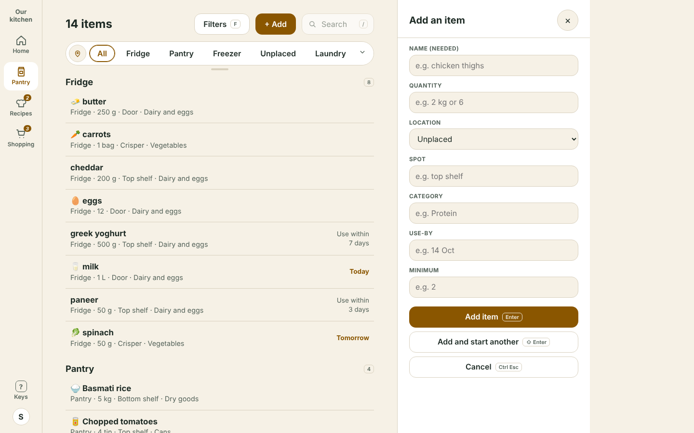

# Desktop handover for the building agent

**This is the master reference for the desktop mockup handover.** Start here; the decision record and the PRs sit behind it. Status: **living handover, written 10 October 2026.** The owner said that once the mockups are locked in this must be handed to the building agent with all the notes. Everything below is settled in the mockup unless it is under "Not decided". Mockups stay ahead of the build: show a change here first, never build first (see `AGENTS.md`).

Live mockup: <https://basement-bridge.github.io/mockup/fragments/desktop/pantry.html?sel=butter>. The decision record, in the owner's words and in order, is `docs/knowledge/desktop-layout.md`. Pull requests #37 to #49 in this repo carry the build detail. The Kitchie issues are #402 to #409 and #413; **none is approved for build** until the owner says so.

**Live links are the source of truth** (owner, voice, 10 October 2026: "better than screenshots, the actual link to the mockup along with the hashtags and everything"). Every state below opens from a link; screenshots in `docs/handover/img/` (1440 × 900) are only a quick look. Section 12 lists every link and what each URL option does.

## 1. Rules to follow

- **Mockup and build stay close.** Copy the mockup's markup, CSS and JS first and change only what the real code needs; list each difference in the PR. Tokens only, from `theme.css`.
- **Fetch only when asked (owner, voice, 10 October 2026).** Applies to all desktop work. History is never preloaded: opening the column, and each "show more", is a separate lazy call for that one item only. Nothing refreshes by itself. Default path loads the list and the open item; History, Filters options, Add form and Profile load on engagement.
- **Close with Ctrl or Cmd plus Enter (owner, voice, 10 October 2026; it replaced Ctrl/Cmd plus Esc).** Plain Esc takes a browser out of full screen. Every close on desktop (Filters and Sort, History, the item and its edit, Add, the shortcuts list, Profile) uses the modifier; plain Esc only clears the search box. Show the platform's own key in hints (`Ctrl Enter` or `⌘ Enter`). In the Add form plain Enter adds; Ctrl/Cmd Enter closes.
- Shortcut cues can be switched off (the toggle in the `?` list). Anything that shows a key hint must carry the `kbd` class (or `keep` when it must stay).

## 2. Layout

- Rail 88px on the left, then the main column (640px with 48px gutters, a 736px lane), then the right lane (400px). The group is left-anchored; the gap between list and panel is always one gutter.
- Desktop is **a hidden-control Device mode of the household flow** (move to the top edge, press the backtick, or Tab to it). Sizes: Phone 390, Tablet 768, Small 1024, Laptop 1280, Wide 1440, Full HD 1920, QHD 2560. `fragments/device.js`.
- **One parent flyout at a time (owner, voice, 10 October 2026).** Opening Filters, the item panel, History or Add replaces whatever parent flyout was open, together with its child (Sort belongs to Filters, History to the item). A child never closes its own parent. Clicking a row closes Filters; Filters and Add close History; `,` closes Filters. J K while Filters is open keep it open (nothing is opened).
- A second column (History, or Sort) pushes out to the right of the panel (320px). Below 1240px wide it lays over the right edge instead of narrowing the list.

## 3. Pantry

- **Header:** no "Pantry" title. Count, Filters and Add on the left; Search on the right, dimmed until clicked or `/`. Focusing Search hides Add.
- **Location and Category pills** on the face: one row by default, a drag bar to show more rows, a corner arrow, and double-click to show everything. Location and Category switch with a pin / tag button (as in Kitchie uat).
- **Counted vs level-only items** (`docs/adr/pantry-item-sheet.md` in Kitchie): the **Use one** button and the `U` key exist only for counted items. Level-only items change by level (rules of levels still apply).
- **Filters in use:** when any filter is picked the pill strip is replaced by removable tiles and "Clear all".
- **Shortcuts** (the `?` list is a two-column grid, anchored to the left edge of the main column; one column below 760px): `?` or `H` list; ↑ ↓ or J K move; Enter or E edit; U use one; D used up; S shopping list; Z undo; N add; F Filters; `/` search; G then H, P, R, S go to a screen; **`,` (comma) opens or closes History for the open item** (owner, voice, 10 October 2026, Slack's convention; one press, not two); **M focuses the first item in the main column** (owner, 10 October 2026, from any panel; the panel stays open; ignored while typing in a box). (The Profile window has its own `G Y`.)

## 4. Filters (right lane) and Sort (flyout)

**Filters is a live panel in the right lane, not a window.** Picks update the centre list as you go. Plain click picks one; Ctrl or Cmd click adds more. Statuses combine with OR, the groups (Status, Location, Category) with AND. The owner chose the old "Option C" controls, moved to the right.

**Status** (exactly three; the owner removed "On your list" and "No use-by set"). Each row: check circle, label, a sub-line ("in 1 week · 4 items"), a number key (1 to 3).

| Status | Window | Default |
|---|---|---|
| Running low | none (on or off) | n/a |
| Expiring soon | 3 days, 1 week, 2 weeks, 1 month | 1 week |
| Recently added | 24 hours, 3 days, 5 days, last week | 3 days |

- **Window control** is a single pill `‹ 1 wk ›` (left and right angle arrows), not plus and minus buttons. Keys: `Shift <` and `Shift >` step the status row you are on (or the last one used). The key is **not** drawn on the pill (the row is crowded); it is only in the `?` list. Clear resets the windows to the defaults.
- A status with no items gets the dashed look, like zero-count pills (the owner likes it and wants it kept).

**Location and Category** are pills with icons (Location) or ticks (Category) and counts. Zero count is dim and dashed. Both sit in a **curtain**: one row by default, a grip under it to drag down, a corner arrow, double-click to show all. Opened, it grows to fit but **never past five lines**; beyond five it scrolls inside. Arrow keys resize and Enter toggles when the grip has focus.

**Sort is a flyout** (the owner tried a tab, then chose this). A "Sort" row at the top of Filters shows the current sort and pushes a second panel to the right. Choices are three rows, **Name, Use-by, Added**; each is one button that shows its direction in brackets and flips it when pressed again: Name (A to Z / Z to A), Use-by (Soonest first / Latest first), Added (Newest first / Oldest first). Category is not a sort (owner). Pressing another row starts it in its first direction; Clear (or the tile's x) goes back to "As listed". **Both panels end in a round tick instead of "Done".** The tick on Sort closes only Sort; the tick on Filters closes both. `Ctrl/Cmd Enter` closes Sort first, then Filters. "Use last filters" and "Clear" sit in the Filters footer.

## 5. History

- A column on the right of the item panel, opened with `,` or the History button, closed with the same key, the x or `Ctrl/Cmd Enter`. **This item only**, real history only, never sample rows and never project history.
- Not shown by default. When shown: the last **3 days that have entries** (quiet days are skipped), then **5 more days** per "show more".
- Long values are cut with an ellipsis and carry the full text as a tooltip.
- Kitchie source: journal-based history (`store.getHistory(id)`, MCP `item_history`). Requirement: lazy, on demand (section 1).

## 6. Add item: Option A, side panel (chosen)

Owner, voice, 10 October 2026: "option A for add an item". A side panel in the right lane, like Filters, with every field: name (needed), quantity, location, spot, category, use-by, minimum. Enter adds; Shift Enter adds and starts another; `Ctrl/Cmd Esc` or the x cancels; new items default to Unplaced and count as "recently added". The quick-add bar and the window were drawn, not chosen, and are removed.

## 7. Profile

Option B only: a true modal window (scrim covers everything, page behind inert, focus trapped and returned). Sections: Profile, Settings, History, Household, My data, each with a `G` then letter key. Source: `fragments/desktop-profile/`, exposed as `window.KProfile`.

## 8. How the mockup differs from Kitchie `uat` today

Found by reading `uat` (read only; nothing was changed there).

- **Status keys already match** (`low`, `soon`, `recent`, in `server/src/assets/list.js` `STATUS`). The mockup's windows differ: Recently added has 24 hours, 3 days, **5 days**, last week with default **3 days**; `uat` has 24 hours, 3 days, last week with default **24 hours**.
- **Running low** in `uat` is the shopping list's own "low" marker. In the mockup it is derived from an item's level and minimum. The owner wants **Level** to replace it (see below).
- **Sort** in `uat`: Name, Use by, Added with a direction. The mockup now matches: Name, Use-by, Added, one row each, press again to flip. Direction labels are the mockup's; `uat`'s Added default may differ.
- **Levels** are defined once, in `server/src/stock.ts` (`LEVELS`: plenty, some, low, out). The item sheet words them Plenty, Some, Running low, Out (`server/src/assets/item-sheet.js`).
- **Not in the mockup yet and not built in the app:** everything in this document. The desktop layout from `docs/knowledge/desktop-layout.md` is built in Kitchie v0.49.0 and v0.49.1 (merged to `uat` only).

## 9. Not decided (ask the owner; do not guess)

1. **Level filter (not final, not built).** The owner said "rather than Running low... we should simply say Level", with options drawn from the real config (not invented), and that it must change in UAT and prod too. Real list: Out, Running low (`low`), Some, Plenty. Open: pick one level or several; where the row sits; Recently added default (3 days or the real app's 24 hours). Not built in the mockup yet.
2. **Which of issues #402 to #409 and #413 are released for build.**
3. **Next desktop screens to draw:** Recipes, Shopping (only Home and Pantry exist).
4. **Scenario controls on desktop.** The household flow's scenario controls (persona, invite, household, jump to) do not load at desktop sizes, because desktop opens its own page. Proposed fix: share the same state and Controls panel, carried in the URL. Not built.
5. **"Same number of rows" elsewhere.** The owner asked for a similar row limit "elsewhere"; the Category curtain already has it. Other places not named.
6. **The "focus" shortcut.** M is my proposal for the main column; the owner said it needs its own single key and left the letter to me.

## 10. How to build it: one coordinator, several agents, one consistency rule

Owner, voice, 10 October 2026: it is implemented **through multiple agents with a single coordinator orchestrating it**; every agent works **from the agreed mockups** (this document and the live links in section 12); the coordinator **adversarially challenges inconsistencies**; and for patterns, toggles, controls and flows, **two things that look the same must not have two visual treatments.**

- **Coordinator:** splits the work (suggested: shell and layout; Pantry list and item panel; Filters and Sort; History and Add; Profile and shortcuts), gives each agent the mockup file and link it copies from, merges, and runs the review below before anything goes to `uat`. Agents do not change the mockup's behaviour; a difference goes in the PR, and a change to a settled mockup is shown in the mockup repo first.
- **Adversarial review (coordinator, or a separate agent that has not seen the build):** open every state from section 12 in the built app next to the mockup link; try to break the rules in section 1 and the exclusivity rule (one parent flyout at a time); list every control that looks the same but is built differently; fail the build on any of them.
- **Control inventory the build must reuse (one component each):** close = round outline x (44px, 20px glyph) in every panel and window; done = round filled tick (Filters, Sort); on/off row = check circle (Status); single or multi pick = pill (Location, Category, with counts); one-of-three with direction = full-width row with the direction in brackets (Sort); switch = the On/Off pill (shortcut cues); stepper = `‹ value ›` pill; tiles for item fields; the same `kbd` hint everywhere. A new look for any of these needs the owner.
- **Found and fixed in the mockup by the first pass (10 October 2026):** three different close-button backgrounds and glyph sizes (now one); the new Sort rows versus the Filters Sort row (same size and font now).
- **Still different, flagged for the owner (not fixed, because the choice is visual):** (a) the pills on the Pantry face (36px, transparent) versus the pills in Filters (44px, cream, counts); (b) three on/off looks: the Status check circle, the On/Off pill in the `?` list, and the pin/tag mode button; (c) tick versus x as the way out of a panel (intended: tick keeps and closes, x closes, but the History column has only an x).

## 11. File map (mockup)

- `fragments/desktop/desktop.js`, `desktop.css`: the Pantry and Home screens (state, Filters, Sort, History, Add, shortcuts).
- `fragments/desktop-profile/`: the Profile window.
- `fragments/device.js`: the hidden Device control. `flows/household/`: the phone flow.
- `docs/knowledge/desktop-layout.md`: decision record. `docs/handover/`: this file and its pictures.
- To regenerate pictures, serve the folder (`python3 -m http.server`) and use Playwright at 1440 × 900.

## 12. Live links (open the real mockup in any state)

Base: `https://basement-bridge.github.io/mockup/fragments/desktop/`. Add `&vp=1280` (or 1024, 1440, 1920, 2560) to see it in a window of that exact size; phone and tablet sizes open the household flow.

| State | Link |
|---|---|
| Home | `home.html` |
| Pantry, item open | `pantry.html?sel=butter` |
| History column | `pantry.html?sel=butter&hist=1` |
| Filters, clean | `pantry.html?filters=1` |
| Filters, location and category curtains open | `pantry.html?filters=1&curtain=1` |
| Filters, Expiring soon (2 weeks) and Recently added (5 days) | `pantry.html?filters=1&st=soon,recent&soonwin=2&recentwin=2` |
| Filters in use plus the Sort flyout | `pantry.html?filters=1&st=low&loc=Pantry&sortby=name&panel=sort` |
| Shortcuts list | `pantry.html?help=1` |
| Profile window | `pantry.html?profile=1` |
| Add form (side panel) | `pantry.html?add=a&open=add` |
| Laptop size, both flyouts | `pantry.html?filters=1&panel=sort&vp=1280` |

URL options on `pantry.html` (all optional, they combine):

- `sel=<id>`: the open item (ids: butter, carrots, cheddar, eggs, yog, milk, paneer, spinach, rice, tom, onion, garam, peas, ice). `hist=1` opens its History.
- `filters=1`: open Filters. `st=low,soon,recent`: statuses on. `soonwin=0..3` and `recentwin=0..3`: window index (see the table in section 4). `loc=Pantry,Fridge`, `cat=Cans`: pills picked. `sortby=name|useby|added` and `sortdir=1` (second direction). `panel=sort`: open the Sort flyout. `curtain=1`: open both curtains. `pre=1`: the older preset (Expiring soon, Dairy and eggs, Use-by soonest).
- `help=1`, `profile=1`: the shortcuts list, the Profile window. `add=a&open=add` (or `open=add`): the Add form.
- `vp=<width>`: show the page in a frame of that size.

The page also writes the open item back into its own address (`sel=`), so copying the address bar shares the open item.

